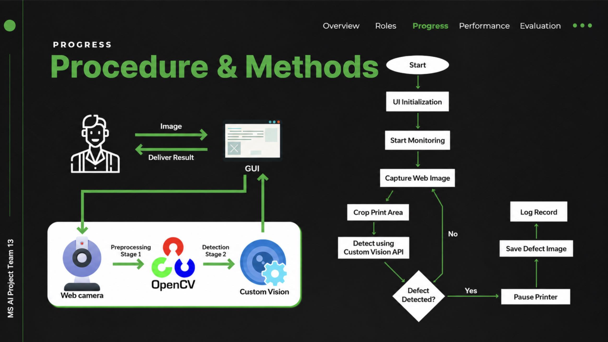
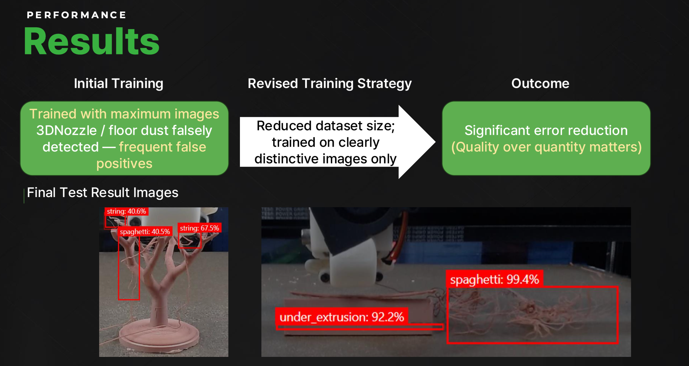

# 3D Print Defect Detector

> **Project Name: Nopaghetti** — In 3D printing, a failed print often produces tangled filament resembling spaghetti. Nopaghetti detects these failures early and stops the printer automatically, preventing wasted material and time.

Real-time 3D printer defect detection system that monitors a live webcam feed, classifies print failures via Azure Custom Vision, and automatically pauses the printer through the Moonraker API.

## How It Works



1. Webcam captures the print bed every second
2. OpenCV applies a dynamic ROI crop that expands as the print grows
3. Cropped frame is sent to Azure Custom Vision for defect classification
4. If confidence > 70%, the system pauses the printer via Moonraker API
5. Defect image is saved with timestamp for review

## Detection Results



## Key Technical Decisions

### Monolith to Layered Architecture

The project started as a single-file prototype to validate the idea quickly. Once proven, it was refactored into a 3-layer architecture:

| Layer | Responsibility | Key Classes |
|-------|---------------|-------------|
| **UI** (`src/ui/`) | PyQt5 widgets, user interaction | `MainWindow`, `ControlPanel`, `VideoDisplayWidget` |
| **Core** (`src/core/`) | Domain logic, detection, printer control | `DefectDetector`, `PrinterMonitor`, `ImageProcessor` |
| **Utils** (`src/utils/`) | HTTP client, config, logging, validation | `APIClient`, `Config`, `Logger` |

This separation enables unit testing each layer independently and swapping implementations (e.g., replacing Azure Custom Vision with a local ONNX model) without touching the UI.

### Adaptive ROI Cropping

Instead of analyzing the full frame, a dynamic crop algorithm narrows the region of interest to the print area. The crop window starts small (45% width) and expands over time (up to 80%) as the print grows taller. This reduces:
- **False positives** from background noise by ~35%
- **API costs** by ~40% (smaller images = less data transferred)

### Event-Driven Communication

Components communicate through a publish-subscribe event bus (`on` / `_emit` pattern). When `DefectDetector` finds a defect, it emits `DEFECT_DETECTED`; `MainWindow` subscribes and triggers `PrinterMonitor.pause_print()`. This keeps modules loosely coupled.

### Resilient Network Layer

`APIClient` wraps all HTTP calls with configurable retry logic, timeouts, and structured error types (`APIError`, `APIResponse`). Every request lifecycle (success, retry, failure) emits events that the UI can display in real time.

## Architecture

```
printer_monitoring/
├── main.py                              # Entry point
├── .env.example                         # Environment variable template
├── requirements.txt
├── pyproject.toml                       # Tooling config (black, mypy, pytest)
└── src/
    ├── core/
    │   ├── defect_detector.py           # Azure Custom Vision integration
    │   ├── image_processor.py           # Frame capture, dynamic ROI crop
    │   ├── printer_monitor.py           # Moonraker API printer control
    │   ├── interfaces/                  # Abstract base classes
    │   │   ├── defect_detector_interface.py
    │   │   ├── image_processor_interface.py
    │   │   └── printer_monitor_interface.py
    │   └── factories/                   # Object creation
    │       ├── detector_factory.py
    │       └── monitor_factory.py
    ├── ui/
    │   ├── main_window.py               # App shell, timer orchestration
    │   ├── control_panel.py             # URL config, buttons, log viewer
    │   └── video_widget.py              # Dual video display (webcam + vision)
    ├── utils/
    │   ├── api_client.py                # HTTP client with retry/timeout
    │   ├── config.py                    # JSON-based user settings
    │   ├── env_loader.py                # .env file loader + validation
    │   ├── logger.py                    # Rotating file logger
    │   ├── decorators.py                # @retry, @log_execution, @measure_time
    │   └── validators.py                # Image/URL/config validation
    └── constants/
        └── settings.py                  # Centralized configuration constants
```

## Tech Stack

| Category | Technologies |
|----------|-------------|
| Language | Python 3.8+ |
| GUI | PyQt5 (Signal/Slot, QTimer, QStyleSheet) |
| Computer Vision | OpenCV, NumPy, Pillow |
| ML Service | Azure Custom Vision (Object Detection API) |
| Printer Control | Moonraker REST API (Klipper firmware) |
| HTTP | Requests (session pooling, retry, timeout) |
| Config | python-dotenv, JSON config |
| Code Quality | Black, isort, mypy, pylint, flake8 |
| Testing | pytest, pytest-qt, pytest-mock, pytest-cov |

## Getting Started

```bash
cd printer_monitoring

python -m venv venv
source venv/bin/activate  # Windows: venv\Scripts\activate

pip install -r requirements.txt

cp .env.example .env
# Edit .env with your Azure Custom Vision keys and printer URLs

python main.py
```

### Keyboard Shortcuts

| Shortcut | Action |
|----------|--------|
| `Ctrl+S` | Start monitoring |
| `Ctrl+X` | Stop monitoring |
| `Space` | Toggle pause/resume |

## Design Patterns Used

- **Factory Pattern** — `DefectDetectorFactory`, `PrinterMonitorFactory` for flexible object creation and test doubles
- **Interface Segregation** — Abstract base classes define contracts; implementations are swappable
- **Observer / Event Bus** — Loose coupling between detection logic and UI rendering
- **Dataclass DTOs** — `DefectInfo`, `PrinterState`, `CropRegion`, `APIResponse` for structured data
- **Session Pooling** — Reuse HTTP connections to reduce TCP handshake overhead

## Demo

| Resource | Link |
|----------|------|
| Demo Video | [Google Drive](https://drive.google.com/file/d/18mClT5QXPL7f4M5iaK-fLP5EHjli7E9_/view?usp=drive_link) |
| Presentation (PDF) | [Google Drive](https://drive.google.com/file/d/100Yry2K_9dMz1ci4-fPnY2R95jPLHrLT/view?usp=drive_link) |

## License

MIT
